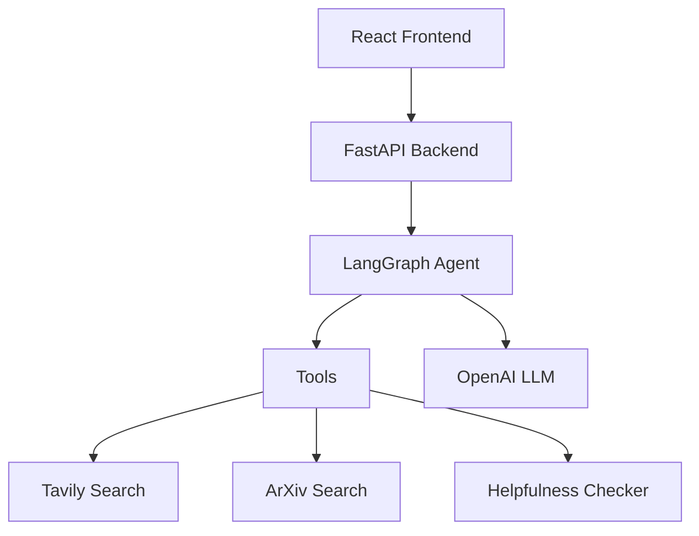

# LangGraph AI Agent - Railway Deployment

A modern, full-stack AI application built with **React + Next.js frontend** and **FastAPI backend**, featuring an intelligent AI agent powered by LangGraph for complex multi-step reasoning, web search, and academic research. **Optimized for Railway deployment**.

## 🚀 Features

- **Intelligent Agent Workflow**: LangGraph-powered multi-step reasoning
- **Real-time Web Search**: Tavily integration for current information
- **Academic Research**: ArXiv search for scientific papers
- **Modern React Frontend**: Next.js with TypeScript and Tailwind CSS
- **FastAPI Backend**: High-performance REST API
- **Real-time Chat Interface**: WebSocket-like experience
- **Quality Control**: Built-in response evaluation
- **Vercel Ready**: One-click deployment to Vercel

## 📁 Project Structure

```
├── frontend/                 # React + Next.js application
│   ├── app/                 # Next.js App Router
│   ├── components/          # React components
│   ├── lib/                 # Utilities and services
│   └── package.json         # Frontend dependencies
├── backend/                 # FastAPI application
│   ├── main.py             # FastAPI server
│   └── requirements.txt     # Backend dependencies
├── src/                     # Shared agent logic
│   ├── agents/             # LangGraph agent implementations
│   ├── tools/              # Tool integrations
│   └── utils/              # Utilities and configuration
├── vercel.json             # Vercel deployment config
└── README.md              # This file
```

## 🛠 Quick Start

### Prerequisites

- **Node.js 18+** (for frontend)
- **Python 3.8+** (for backend)
- **OpenAI API key**
- **Tavily API key**

### Development Setup

1. **Clone and setup environment:**
   ```bash
   git clone <your-repo>
   cd my_first_advanced_app
   cp .env.example .env
   # Edit .env with your API keys
   ```

2. **Backend setup:**
   ```bash
   cd backend
   pip install -r requirements.txt
   python main.py
   # Backend runs on http://localhost:8000
   ```

3. **Frontend setup (in new terminal):**
   ```bash
   cd frontend
   npm install
   npm run dev
   # Frontend runs on http://localhost:3000
   ```

4. **Open your browser:**
   - Frontend: `http://localhost:3000`
   - Backend API docs: `http://localhost:8000/docs`


## 🚂 Deploy to Railway

### 🚀 One-Click Railway Deployment

Deploy your LangGraph AI Agent to **Railway** for reliable, traditional server hosting perfect for complex AI applications!

1. **Install Railway CLI:**
   ```bash
   npm install -g @railway/cli
   railway login
   ```

2. **Deploy from this directory:**
   ```bash
   railway init my-langgraph-backend
   railway up
   ```

3. **Railway automatically:**
   - ✅ Detects Python + `requirements.txt`  
   - ✅ Installs all LangGraph dependencies
   - ✅ Starts your FastAPI server
   - ✅ Provides HTTPS URL (like `https://myapp.railway.app`)

4. **Update frontend configuration:**
   ```bash
   # Update frontend/.env.local
   NEXT_PUBLIC_RAILWAY_URL=https://your-app.railway.app
   ```

### ⚡ Railway Benefits:
- ✅ **Perfect for AI/ML apps** - No serverless limitations
- ✅ **Full Python support** - All LangGraph dependencies work
- ✅ **No cold starts** - Always-warm server, instant responses
- ✅ **Persistent connections** - Database connections stay alive
- ✅ **Predictable pricing** - $5/month hobby, scales up
- ✅ **Built-in monitoring** - Logs, metrics, and alerts
- ✅ **Auto-scaling** - Handles traffic spikes gracefully

### 🔑 Railway Environment Variables:
Set these in Railway dashboard (optional - users can provide their own):
```bash
OPENAI_API_KEY=your_openai_key        # Optional fallback
TAVILY_API_KEY=your_tavily_key        # Optional fallback
PYTHONPATH=./src:./backend            # Required for imports
```

### 📁 Railway Configuration Files:
- `railway.toml` - Railway deployment settings
- `nixpacks.toml` - Build and runtime configuration  
- `railway_start.py` - Optimized startup script

### 🔗 Architecture:
```
Frontend (Vercel/Local) → Railway Backend → LangGraph Agent → OpenAI/Tavily APIs
```

## 🔧 API Endpoints

The FastAPI backend provides these endpoints:

- `GET /health` - Health check and status
- `POST /chat` - Send message to agent
- `GET /chat/{session_id}/history` - Get conversation history
- `DELETE /chat/{session_id}` - Clear chat history
- `GET /sessions` - List all sessions

## 💡 Usage

1. **Start a conversation** by typing in the chat interface
2. **Ask questions** like:
   - "What's the latest news about AI?"
   - "Find research papers about quantum computing"
   - "Explain machine learning concepts"
3. **View metadata** including tools used, processing time, and quality scores
4. **Start new sessions** or clear chat history using the sidebar

## 🧪 Development

### Frontend Development

```bash
cd frontend
npm run dev          # Start development server
npm run build        # Build for production
npm run lint         # Run ESLint
```

### Backend Development

```bash
cd backend
python main.py       # Start FastAPI server
pytest              # Run tests
```

### Agent Development

```bash
cd src
pytest tests/        # Run agent tests
black .             # Format code
flake8 .            # Lint code
```

## 🔑 Environment Variables

### Required

- `OPENAI_API_KEY`: OpenAI API key for LLM
- `TAVILY_API_KEY`: Tavily API key for web search

### Optional

- `LANGCHAIN_API_KEY`: LangSmith for tracing and evaluation
- `LANGCHAIN_TRACING_V2=true`: Enable LangSmith tracing
- `NEXT_PUBLIC_BACKEND_URL`: Backend URL (auto-configured)

## 🚀 Architecture



## 📦 Technologies

**Frontend:**
- Next.js 14 (App Router)
- React 18
- TypeScript
- Tailwind CSS
- Axios for API calls

**Backend:**
- FastAPI
- Pydantic
- CORS middleware
- Uvicorn ASGI server

**AI/Agent:**
- LangGraph
- LangChain
- OpenAI GPT-4
- Tavily Search API
- ArXiv API

## 🤝 Contributing

1. Fork the repository
2. Create a feature branch: `git checkout -b feature/amazing-feature`
3. Commit your changes: `git commit -m 'Add amazing feature'`
4. Push to the branch: `git push origin feature/amazing-feature`
5. Open a Pull Request

## 📝 License

This project is licensed under the MIT License - see the [LICENSE](LICENSE) file for details.