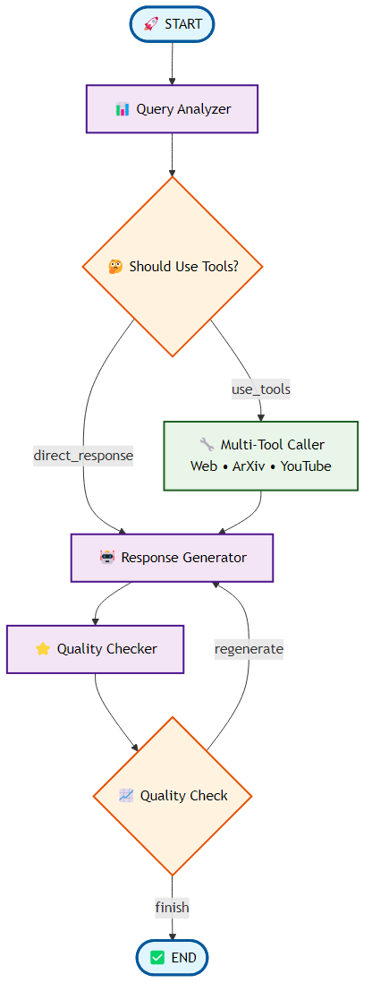

# LangGraph AI Agent

An intelligent multi-tool AI agent built with LangGraph that searches web, academic papers, and educational videos to provide comprehensive, cited responses.

## Overview

This application combines the power of LangGraph's workflow orchestration with multiple search tools to create an AI agent that can intelligently gather information from diverse sources and provide well-researched, cited responses.

**Live Application**: https://myfirstadvanced-r0yha9x6b-inesaranabs-projects.vercel.app

## Key Features

- **Multi-Source Search**: Intelligently searches web (Tavily), academic papers (ArXiv), and educational videos (YouTube)
- **Quality Assessment**: Built-in response evaluation system using GPT-based helpfulness scoring
- **Real-Time Streaming**: Fast, responsive chat interface with streaming responses
- **Source Attribution**: Automatic citation and source tracking for all information
- **Smart Routing**: AI-driven tool selection based on query analysis

## Architecture

**Frontend** (Next.js + TypeScript)
- Modern React-based chat interface
- Real-time streaming responses
- Source panel with citations
- Responsive design with dark theme

**Backend** (FastAPI + LangGraph)
- LangGraph workflow orchestration
- Multi-tool agent with conditional routing
- Response quality evaluation
- RESTful API with streaming support

**AI Tools**
- Web Search (Tavily API)
- Academic Search (ArXiv API) 
- Video Search (YouTube API)
- Helpfulness Evaluation (OpenAI GPT)

## Workflow

The LangGraph AI Agent follows a sophisticated 5-node workflow with intelligent routing and quality control:



**Flow Overview:**
1. **Query Analysis** - Analyzes input to determine required tools (Web/ArXiv/YouTube)
2. **Tool Execution** - Runs appropriate searches based on query type
3. **Response Generation** - Creates comprehensive answer with source citations  
4. **Quality Assessment** - Evaluates response helpfulness and regenerates if needed
5. **Final Output** - Returns polished response with metadata

## Quick Start

### Prerequisites
- Python 3.11+
- Node.js 18+
- OpenAI API key
- Tavily API key

### Setup
```bash
# Clone repository
git clone https://github.com/inesaranab/langgraph-ai-agent.git
cd langgraph-ai-agent

# Setup environment
cp .env.example .env
# Add your API keys to .env

# Install dependencies
pip install -r requirements.txt
cd frontend && npm install && cd ..

# Launch application
python dev.py
```

## API Endpoints

### Health Check
```http
GET /health
```

### Chat
```http
POST /chat/stream
Content-Type: application/json

{
  "message": "Your question",
  "session_id": "unique-id",
  "openai_api_key": "your-key",
  "tavily_api_key": "your-key"
}
```

## Project Structure

```
 backend/           # FastAPI server
 frontend/          # Next.js application
 src/
    agents/        # LangGraph agent implementation
    tools/         # Search and evaluation tools
    utils/         # Configuration and utilities
 tests/            # Test suites
```

## Deployment

- **Frontend**: Deployed on Vercel
- **Backend**: Deployed on Railway
- **Database**: Stateless (session-based)

## Tech Stack

**Backend**: FastAPI, LangGraph, LangChain, OpenAI, Tavily, ArXiv  
**Frontend**: Next.js, TypeScript, Tailwind CSS  
**Infrastructure**: Railway, Vercel, Docker

## Contributing

1. Fork the repository
2. Create a feature branch
3. Make your changes
4. Submit a pull request

## License

MIT License - see LICENSE file for details.
