# LangGraph Agent Workflow Documentation

This document provides a visual representation of the LangGraph agent workflow using Mermaid diagrams.

## Agent Workflow Graph

The LangGraph agent follows a sophisticated 5-node workflow with conditional routing and quality control.

```mermaid
graph TD
    A[🚀 START] --> B[📊 Analyzer]
    
    B --> C{🤔 Should Use Tools?}
    C -->|needs_web_search OR needs_arxiv_search| D[🔧 Tool Caller]
    C -->|Simple query| E[🤖 Responder]
    
    D --> D1[🌐 Web Search<br/>Tavily API]
    D --> D2[📚 ArXiv Search<br/>Academic Papers]
    D --> D3[🎥 YouTube Search<br/>Educational Videos]
    
    D1 --> E
    D2 --> E
    D3 --> E
    
    E --> F[⭐ Helpfulness Checker]
    
    F --> G{📈 Quality Check}
    G -->|Score < 0.3 AND iterations < 2| E
    G -->|Score >= 0.3 OR max iterations| H[✅ END]
    
    style A fill:#e1f5fe
    style H fill:#e8f5e8
    style C fill:#fff3e0
    style G fill:#fff3e0
    style D1 fill:#f3e5f5
    style D2 fill:#f3e5f5
    style D3 fill:#f3e5f5
```



## Detailed Node Descriptions

### 1. 📊 Analyzer Node
**Function**: `_analyze_query(state)`
- Analyzes user query to determine required tools
- Sets flags for web search and ArXiv search needs
- **Web Search Triggers**: news, current, recent, technology, AI, complex queries (>3 words)
- **ArXiv Search Triggers**: research, paper, study, academic, scientific, algorithm

### 2. 🔧 Tool Caller Node  
**Function**: `_call_tools(state)`
- Executes tools based on analyzer decisions
- **Available Tools**:
  - **🌐 Tavily Web Search**: Real-time web information
  - **📚 ArXiv Search**: Academic papers and research
  - **🎥 YouTube Search**: Educational video content
- Aggregates results from multiple sources

### 3. 🤖 Responder Node
**Function**: `_generate_response(state)`
- Synthesizes information from tools or provides direct answers
- Uses OpenAI GPT-4 for response generation
- Incorporates search results and citations
- Maintains conversation context

### 4. ⭐ Helpfulness Checker Node
**Function**: `_check_helpfulness(state)`
- Evaluates response quality using GPT-3.5-turbo
- Scores responses on 0.0-1.0 scale
- **Criteria**: Relevance, Accuracy, Completeness, Clarity, Usefulness

### 5. Conditional Routing

#### Should Use Tools Decision


#### Quality Control Loop


## State Management

### AgentState Schema
```python
class AgentState(TypedDict):
    messages: List[Any]           # Conversation history
    query: str                    # Current user query
    response: str                 # Generated response
    tools_used: List[str]         # Tools executed
    search_results: List[Dict]    # Aggregated search results
    youtube_videos: List[Dict]    # Video search results
    helpfulness_score: Optional[float]  # Quality score (0.0-1.0)
    session_id: str              # Session identifier
    iteration_count: int         # Regeneration attempts
    needs_web_search: bool       # Web search flag
    needs_arxiv_search: bool     # Academic search flag
```

## Tool Integration Architecture

```mermaid
graph TB
    subgraph "🔧 Tool Layer"
        A[Tavily Search Tool]
        B[ArXiv Search Tool] 
        C[YouTube Search Tool]
        D[Helpfulness Checker]
    end
    
    subgraph "🧠 Agent Layer"
        E[LangGraph Agent]
        F[State Management]
    end
    
    subgraph "🌐 API Layer"
        G[FastAPI Backend]
        H[Streaming Endpoints]
    end
    
    subgraph "💻 Frontend Layer"
        I[React Chat UI]
        J[Source Citations]
    end
    
    A --> E
    B --> E
    C --> E
    D --> E
    E --> F
    F --> G
    G --> H
    H --> I
    I --> J
```



## Performance Characteristics

- **Average Response Time**: 2-5 seconds
- **Tool Execution**: Parallel where possible
- **Quality Control**: Automatic regeneration for low scores
- **Session Management**: Stateless with session IDs
- **Error Handling**: Graceful degradation on tool failures

## Export Instructions

To export this workflow as a PNG image:

1. **Using Mermaid CLI**:
```bash
npm install -g @mermaid-js/mermaid-cli
mmdc -i workflow.md -o langgraph_workflow.png
```

2. **Using Mermaid Live Editor**:
   - Visit: https://mermaid.live/
   - Copy the mermaid code block
   - Download as PNG/SVG

3. **Using VS Code Extension**:
   - Install "Mermaid Markdown Syntax Highlighting"
   - Open this file and use preview export

## Integration Points

The workflow integrates with external services:

- **OpenAI API**: GPT-4 for responses, GPT-3.5-turbo for evaluation
- **Tavily API**: Real-time web search capabilities  
- **ArXiv API**: Academic paper search and metadata
- **YouTube Search**: Educational video discovery
- **FastAPI**: RESTful endpoints with streaming support
- **Vercel/Railway**: Cloud deployment infrastructure